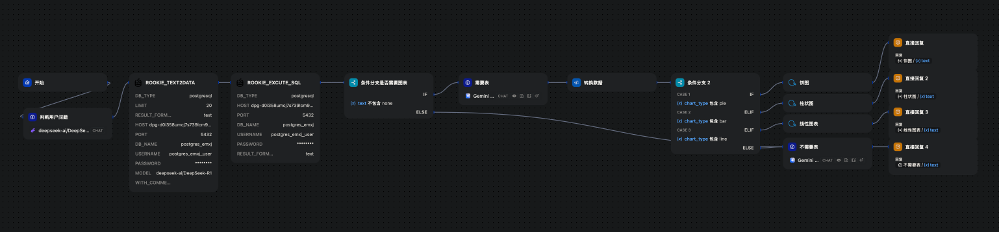

# Workflows-Agent Learning Notes

本项目仓库主要用于记录和整理 AI Agent 工作流的实践过程。
所有应用均通过 Docker 在本地环境中部署和测试。（例见Dify官方文档）内容会随着学习的拓展更新。

## 1. 基础 RAG 实践

通过从知识库中检索相关信息，并将其作为上下文提供给大语言模型（LLM），来解决 LLM 自身知识陈旧或“胡说八道”的问题。

1.  **构建知识库**：首先，在 Dify 的“知识库”中创建一个专门存放医学指南的库。将例如《ACC/AHA 心血管风险评估指南》、《ASA 麻醉风险分层标准》等权威资料的 PDF 或 DOCX 文档上传进去。对这些文档进行切片、清洗和向量化，以便后续检索。
2.  **搭建基础工作流**：
    * **`开始`节点**：设置用户需要输入的患者信息，如年龄、病史、手术类型等。
    * **`知识检索`节点**：这是 RAG 的核心。将用户输入的信息或经过初步处理的查询语句作为输入，此节点会从指定的医学指南知识库中，检索出最相关的条款或段落。
    * **`LLM` 节点**：将`知识检索`节点返回的内容作为上下文（Context），连同患者信息一起，通过Prompt 发送给 LLM。Prompt 会要求 LLM 扮演“围手术期医学专家”的角色，并严格依据提供的指南内容，对患者情况进行分析和评估。
    * **`结束`节点**：输出 LLM 生成的评估报告。

通过这种方式，Agent 的回答就不是凭空捏造，而是严格基于的专业知识或者标准，大大提升了可靠性。


## 2. Text-to-SQL 与数据自动可视化

这个实践的核心目标是实现通过日常对话的方式，查询并分析数据库中的数据，生成可视化图表。

### 2.1. 环境准备

**a. 搭建数据库 (此处以 Render.com 为例)**

为了让 Dify 云平台或本地 Docker 部署的 Dify 都能够稳定访问，我选择在 Render.com 上创建一个免费的 PostgreSQL 实例。如果是本地部署的，当然推荐使用postgresql哈，图形化界面。

1.  **创建实例**：在 Render.com 注册并创建一个新的 PostgreSQL 服务。
2.  **获取连接信息**：创建成功后，记录下数据库的 **主机名 (Host)**、**端口 (Port)**、**数据库名 (Database)**、**用户名 (Username)** 和 **密码 (Password)**。这些信息在后续配置 Dify 插件时会用到。

**b. 创建表结构与导入数据**

使用 `psql` 或任何数据库管理工具连接到上述数据库，执行以下 SQL 脚本来创建表结构和插入初始数据。

* **表结构 (`CREATE TABLE`)**

    ```sql
    -- 用户表
    CREATE TABLE users (
        id SERIAL PRIMARY KEY, --用户ID，主键
        username VARCHAR(50) NOT NULL UNIQUE, --用户名
        phone VARCHAR(11) NOT NULL UNIQUE, --手机号
        email VARCHAR(100) UNIQUE, --电子邮箱（唯一）
        address VARCHAR(200), --收货地址
        created_at TIMESTAMP DEFAULT CURRENT_TIMESTAMP --创建时间
    );

    -- 产品表
    CREATE TABLE products (
        id SERIAL PRIMARY KEY, --商品ID，主键
        product_name VARCHAR(100) NOT NULL, --商品名称
        price NUMERIC(10,2) NOT NULL CHECK (price > 0), --商品价格（必须＞0）
        stock INT NOT NULL CHECK (stock >= 0), --库存数量（必须≥0）
        status VARCHAR(10) CHECK (status IN ('上架', '下架')),  --商品状态（上架/下架）
        created_at TIMESTAMP DEFAULT CURRENT_TIMESTAMP --创建时间
    );

    -- 订单表
    CREATE TABLE orders (
        id SERIAL PRIMARY KEY, --订单ID，主键
        user_id INT REFERENCES users(id), --用户ID，外键关联users.id
        order_no VARCHAR(20) NOT NULL UNIQUE, --订单编号
        total_amount NUMERIC(10,2) NOT NULL, --订单总金额
        status VARCHAR(10) CHECK (status IN ('已付款', '已发货', '已完成', '已取消')), --订单状态(已付款/已发货/已完成/已取消)
        order_time TIMESTAMP DEFAULT CURRENT_TIMESTAMP --下单时间
    );

    -- 订单明细表
    CREATE TABLE order_items (
        id SERIAL PRIMARY KEY, --明细ID，主键
        order_id INT REFERENCES orders(id), --订单ID，外键关联orders.id
        product_id INT REFERENCES products(id), --商品ID，外键关联products.id
        quantity INT NOT NULL CHECK (quantity > 0), --购买数量（必须＞0）
        unit_price NUMERIC(10,2) NOT NULL, --下单时的商品单价
        total_price NUMERIC(10,2) GENERATED ALWAYS AS (quantity * unit_price) STORED --明细总价（自动计算：数量×单价）
    );
    ```

* **测试数据 (`INSERT INTO`)**

    ```sql
    INSERT INTO users (username, phone, email, address) VALUES
    ('张三', '13812345678', 'zhangsan@example.com', '北京市朝阳区'),
    ('李四', '13987654321', 'lisi@example.com', '上海市浦东新区'),
    ('王五', '13698765432', 'wangwu@example.com', '广州市天河区'),
    ('赵六', '13312341234', 'zhaoliu@example.com', '深圳福田区');

    INSERT INTO products (product_name, price, stock, status) VALUES
    ('智能手机', 2999.00, 100, '上架'),
    ('无线耳机', 499.00, 200, '上架'),
    ('智能手表', 899.00, 50, '上架'),
    ('笔记本电脑', 7999.00, 30, '下架'),
    ('蓝牙鼠标', 59.00, 1000, '上架'),
    ('智能音箱', 199.00, 150, '上架');

    -- (更多订单和订单明细数据)
    ```

**c. Dify 配置**

1.  **安装数据库插件**：在 Dify 的 `工具` -> `工具市场` 中，搜索并安装 `rookie_text2data` 和 `rookie_execute_sql` 插件。
2.  **创建知识库**：创建一个知识库，将包含上述 `CREATE TABLE` 语句的表结构文件（.md 或 .txt）上传。这会让 LLM 在生成 SQL 时了解数据库的结构。

### 2.2. Chatflow 工作流搭建



以下是核心节点的配置思路和关键代码。

**节点 1：问题分类器 (LLM)**

* **作用**：判断用户是想闲聊还是查询数据。
* **后续**：使用一个“条件分支”节点，根据 `type` 的值决定工作流的走向。

**节点 2：知识检索**

* **作用**：如果判定为“数据查询”，则从此节点检索之前上传的数据库表结构信息。
* **配置**：关联上一步创建的知识库。将用户问题 `{{sys.query}}` 作为检索的输入。

**节点 3：生成 SQL (LLM)**

* **作用**：这是 Text-to-SQL 的核心，它会根据用户问题和表结构信息生成 SQL 查询语句。
* **上下文 (Context)**：将“知识检索”节点返回的表结构 `result` 作为上下文。
* **Prompt示例**:
    ```
    角色设定
    你是一位资深数据库专家，擅长根据业务需求将自然语言精准转换为符合规范的PostgreSQL语句。
    核心能力
    1. 精通关系型数据库设计，尤其熟悉PostgreSQL语法。
    2. 深入理解当前业务系统的表结构。
    3. 准确识别业务需求中的隐藏条件。
    4. 根据用户需求 {{sys.query}} 生成SQL。
    输入处理流程
    5. 结构确认：先验证问题涉及的表是否存在，检查字段名是否准确。
    6. 关联分析：确认多表关联的连接条件是否正确。
    7. 条件推导：将模糊的业务描述转化为精确的WHERE条件。
    8. 异常处理：识别可能存在的逻辑矛盾或性能陷阱。
    输出要求
    输出sql时不要添加注释信息，直接采用如下格式返回结果：
    [符合ANSI标准的SQL语句]
    【示例】
    用户问题："查询北京用户最近一个月购买过智能手机的订单"
    输出：-- 查询北京用户最近一个月购买过智能手机的订单
    ```
    ```SQL
    SELECT o.order_no, u.username, oi.total_price, o.order_time FROM orders oJOIN users u ON o.user_id = u.idJOIN order_items oi ON o.id = oi.order_idJOIN products p ON oi.product_id = p.idWHERE u.address LIKE '%北京%'AND p.product_name = '智能手机'AND o.order_time >= CURRENT_DATE - INTERVAL '1 month';
    ```

**节点 4：代码执行 (Python)**

* **作用**：清洗 LLM 可能输出的多余字符，比如 Markdown 的代码块标记。
* **输入变量 `arg1`**：引用“生成 SQL”节点的输出 `{{生成SQL.text}}`。
* **Python 代码**:
    ```python
    import re
    def main(arg1: str) -> dict:
        # 使用正则表达式去除 ```sql ... ``` 或 ``` ... ``` 标记
        result = re.sub(r'```sql\n|```', '', arg1)
        return {
            "result": result.strip()
        }
    ```
* **输出变量 `result`**：包含了纯净的 SQL 语句。

**节点 5：SQL 查询 (插件)**

* **作用**：执行 SQL 语句。
* **配置**：
    * **DB_TYPE**: `postgresql`
    * **DB_HOST**, **DB_PORT**, **DB_NAME**, **DB_USER**, **DB_PASSWORD**: 填入之前从 Render.com 获取的连接信息。建议使用 Dify 的“环境变量”功能来管理这些敏感信息。
    * **SQL**: 引用“代码执行”节点的输出 `{{代码执行.result}}`。

**节点 6：结果润色 (LLM)**

* **作用**：将数据库返回的结构化数据（通常是 JSON 格式）转换成通俗易懂的自然语言或者图表回复。
* **上下文 (Context)**：引用“SQL 查询”插件的输出。
* **Prompt**:省略

### 2.3. 自动生成图表

1.  **意图判断与数据转换 (LLM)**：在获取数据库查询结果后，使用一个 LLM 节点判断是否需要图表，并根据判断将数据转换成 Dify 图表节点所需的标准 JSON 格式。
2.  **条件分支**：添加一个“条件分支”节点。
    * 如果上一步 LLM 判断需要生成图表（例如，返回结果包含 `chart_type: "bar"`），则工作流走向图表分支。
    * 如果不需要，则走向常规的文本回复分支。
3.  **图表节点**：在图表分支中，添加插件`Antv`或者`Echarts`的“柱状图”或“饼图”节点。将前面转换好的数据（如图表标题、x轴标签、y轴数据）传入，即可自动渲染出可视化图表。

4.  **最终回复**：将图表或文本组织起来，形成最终的回复内容。

这样，当用户问“本月消费前三的客户是谁”，Agent 不仅能用文字回答，还能直接给出消费金额对比柱状图。


## 3. MCP 实践

MCP 允许 Agent 调用外部或内部的“工具”，是实现复杂任务的关键。

### 3.1. 调用外部工具 (以高德地图为例)

1.  **获取 Key**：在高德开放平台注册并申请一个 Web 服务 API Key。
2.  **添加工具**：在 Dify 的 `工具` -> `提供商` 中找到 `Maps` 或类似工具，点击添加，并将申请到的 Key 填入。
3.  **创建 Agent**：
    * 在“工作室”创建一个 **Agent** 应用（而非 Chatflow）。
    * 选择一个支持工具调用（Function Calling）的模型，如 Qwen 系列。
    * 在“工具”区域，添加刚刚配置好的地图工具。
4.  **编写 Prompt**：省略
5.  **测试**：在预览窗口提问“查询从武汉大学到华中科技大学的交通路线”，Agent 会自动识别意图，调用 MCP 工具并返回路线信息。


### 3.2. 将工作流发布为内部工具

任何一个 Chatflow 都可以被发布为一个 MCP Server，变成一个可以被其他 Agent 调用的“内部工具”。

1.  **创建工作流**：例如，可以创建一个能根据主题模仿李白风格写诗的 Chatflow。
2.  **发布为工具**：在 Dify 的 `工具` -> `自定义` 中，点击“创建自定义工具”，选择“从工作流导入”，然后选中你创建的写诗工作流。
3.  **在 Agent 中使用**：在另一个 Agent 的工具列表中，就可以添加这个“写诗”工具。当用户提出“以月亮为主题，用李白的风格写一首诗”时，Agent 就可以调用这个内部工具来完成任务。

这种方式实现了能力的模块化和复用，非常强大。

## 4. 高阶RAG优化文献检索

这是一个更复杂的 Agent，它模仿了科研人员查阅文献的真实过程：**提出问题 -> 搜索 -> 评估结果 -> 不满意？-> 优化策略再搜 -> ... -> 找到满意结果 -> 总结报告**。整个过程由 AI 自主完成，无需人工干预。

* **节点 1: AI 关键词生成 (LLM)**
    * **输入**: 用户提出的医学问题，例如“老年患者使用丙泊酚麻醉的安全性如何？”
    * **功能**: 第一个 LLM 扮演“文献检索专家”，它不直接回答问题，而是输出一组用于 PubMed 检索的、结构化的英文关键词策略。
    * **Prompt 节选**:
        ```
        任务
        作为AI搜索专家，请分析用户问题并生成最优的PubMed搜索关键词。
        输出格式（严格按此格式）
        SEARCH_KEYWORDS_PRIMARY
        [主要搜索关键词，英文，用AND连接]
        SEARCH_KEYWORDS_SECONDARY
        [备选搜索关键词，英文，用AND连接]
        EXPECTED_RESULTS
        [预期找到多少篇相关文献，只写数字]
        SEARCH_STRATEGY
        [简要说明搜索策略和预期]
        ```

* **节点 2: 智能搜索执行 (代码)**
    * **输入**: 上一步生成的关键词策略。
    * **功能**: Python 代码节点解析输入，然后调用 PubMed 的公共 API (`https://eutils.ncbi.nlm.nih.gov/entrez/eutils/esearch.fcgi`)，按照“主要 -> 备选 -> 扩展”的优先级顺序执行搜索，直到找到足够数量的文献为止。
    * **输出**: 搜索过程日志、找到的文献 PMID 列表、文献标题样本等。
  **示例**：

  ```python
  def main(ai_keywords: str) -> dict:
    import requests
    import re
    def extract_keywords(text):
        """从AI输出中提取关键词"""
        primary = re.search(r'### SEARCH_KEYWORDS_PRIMARY\s*\n([^\n]+)', text)
        secondary = re.search(r'### SEARCH_KEYWORDS_SECONDARY\s*\n([^\n]+)', text)
        broad = re.search(r'### SEARCH_KEYWORDS_BROAD\s*\n([^\n]+)', text)
        expected = re.search(r'### EXPECTED_RESULTS\s*\n(\d+)', text)
        strategy = re.search(r'### SEARCH_STRATEGY\s*\n([^\n]+)', text)
        return {
            "primary": primary.group(1).strip() if primary else "",
            "secondary": secondary.group(1).strip() if secondary else "",
            "broad": broad.group(1).strip() if broad else "",
            "expected": int(expected.group(1)) if expected else 5,
            "strategy": strategy.group(1).strip() if strategy else ""
        }
    def search_pubmed(query, max_results=10):
        """执行PubMed搜索"""
        try:
            params = {
                'db': 'pubmed',
                'term': query,
                'retmax': max_results,
                'retmode': 'json',
                'sort': 'relevance',
                'datetype': 'pdat',
                'reldate': 1095  # 最近3年
            }
            response = requests.get(
                'https://eutils.ncbi.nlm.nih.gov/entrez/eutils/esearch.fcgi',
                params=params,
                timeout=30
            )
            if response.status_code == 200:
                data = response.json()
                pmids = data.get('esearchresult', {}).get('idlist', [])
                return {
                    "success": True,
                    "pmids": pmids,
                    "count": len(pmids),
                    "query": query
                }
            else:
                return {"success": False, "error": f"HTTP {response.status_code}", "query": query}
        except Exception as e:
            return {"success": False, "error": str(e), "query": query}
    # 解析AI生成的关键词
    keywords = extract_keywords(ai_keywords)
    search_log = f"AI搜索策略: {keywords['strategy']}\n"
    search_log += f"预期结果: {keywords['expected']}篇文献\n\n"
    all_pmids = []
    search_attempts = []
    # 按优先级执行搜索
    queries = [
        ("主要关键词", keywords["primary"]),
        ("备选关键词", keywords["secondary"]),
        ("扩展关键词", keywords["broad"])
    ]
    for query_type, query in queries:
        if not query:
            continue
        result = search_pubmed(query, keywords["expected"])
        search_attempts.append(f"{query_type}: '{query}' → {result['count']}篇" if result["success"] else f"{query_type}: '{query}' → 失败")
        if result["success"]:
            # 去重添加PMID
            for pmid in result["pmids"]:
                if pmid not in all_pmids:
                    all_pmids.append(pmid)
            # 如果主要关键词结果充足，就不用继续
            if query_type == "主要关键词" and result["count"] >= keywords["expected"]:
                search_log += f"{query_type}搜索成功，结果充足\n"
                break
        search_log += f"{'ok' if result['success'] else 'no'} {query_type}: {result['count']}篇\n"
    # 获取文献详情样本
    article_sample = ""
    if all_pmids:
        try:
            # 获取前5篇的详情
            pmids_sample = all_pmids[:5]
            summary_params = {
                'db': 'pubmed',
                'id': ','.join(pmids_sample),
                'retmode': 'json'
            }
            summary_response = requests.get(
                'https://eutils.ncbi.nlm.nih.gov/entrez/eutils/esummary.fcgi',
                params=summary_params,
                timeout=30
            )
            if summary_response.status_code == 200:
                summary_data = summary_response.json()
                result_data = summary_data.get('result', {})
                details = []
                for pmid in pmids_sample:
                    if pmid in result_data:
                        article_info = result_data[pmid]
                        title = article_info.get('title', '未知标题')[:100]
                        journal = article_info.get('fulljournalname', '未知期刊')
                        pubdate = article_info.get('pubdate', '未知时间')
                        details.append(f"PMID:{pmid} | {title}... | {journal} | {pubdate}")
                article_sample = "\n".join(details)
        except:
            article_sample = f"PMID列表: {', '.join(all_pmids[:10])}"
    return {
        "search_success": "成功" if all_pmids else "失败",
        "total_found": str(len(all_pmids)),
        "search_process": search_log + "\n".join(search_attempts),
        "pmid_list": ", ".join(all_pmids[:10]) if all_pmids else "无",
        "article_sample": article_sample if article_sample else "未获取到文献详情",
        "ai_strategy": keywords["strategy"],
        "expected_count": str(keywords["expected"]),
        "primary_query": keywords["primary"]
    }
* **节点 3: AI 结果评估 (LLM)**
    * **输入**: 上一步的搜索结果。
    * **功能**: 第二个 LLM 扮演“评估专家”，它根据预设标准（数量、相关性、时效性等）对搜索结果打分，并明确判断自己“满意”还是“不满意”。
    * **Prompt 节选**:
        ```
        评估任务
        作为AI评估专家，请客观评估本次搜索结果的质量。
        输出格式（严格按此格式）
        SATISFACTION_LEVEL
        [满意/不满意]
        QUALITY_SCORE
        [1-10分，整数]
        MAIN_ISSUES
        [主要问题，如果满意则写"无"]
        OPTIMIZATION_SUGGESTIONS
        [具体的优化建议，如果满意则写"无需优化"]
        ```

* **节点 4: 满意度判断 (条件分支)**
    * **功能**: 这是工作流的分叉口。
    * **如果“满意”**: 流程直接跳转到最后的“最终分析”节点。
    * **如果“不满意”**: 流程进入优化循环。

* **节点 5: AI 优化策略 (LLM) - [优化环路]**
    * **输入**: 上一次搜索失败的评估报告（问题所在、优化建议）。
    * **功能**: 第三个 LLM 扮演“优化专家”，它分析失败原因，并生成一套全新的、更优的关键词搜索策略。
    * **输出**: 与节点1格式相同，但内容是经过优化的新策略。

* **节点 6: 优化搜索执行 (代码) - [优化环路]**
    * **功能**: 与节点2类似，但执行的是优化后的新策略。

* **节点 7: 最终分析 (LLM)**
    * **输入**: 无论是初次搜索成功，还是经过优化后成功的最终文献结果。
    * **功能**: 最后一个 LLM 扮演“循证医学专家”，它会综合所有找到的文献，对用户的原始问题进行全面分析，并生成一份详尽的、图文并茂的分析报告，同时展示出 AI 在整个过程中的思考和优化路径。

## 完成工作流
- 生产质量检查助手（基本RAG，知识库，数据库调取,文档修改生成）


- 科研检索助手（如上4；调用mcp服务）

## 未来计划

本仓库作为个人学习笔记，未来会继续探索和实践workflow/agent的更多高级功能，并添加更多应用场景的工作流案例。


